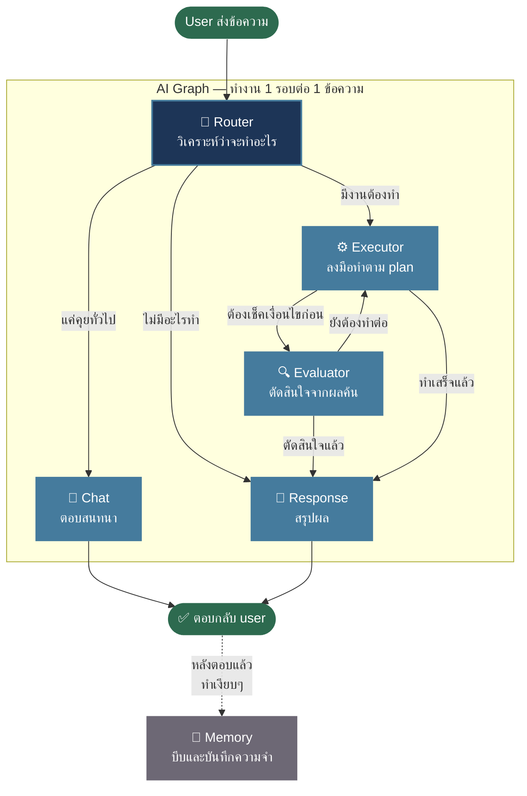
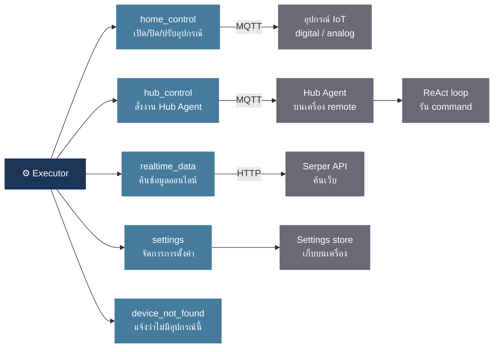

<table><tr>
<td></td>
<td>

# SynaptaOS — Smart Home Dashboard

**Web app ควบคุมบ้านอัจฉริยะที่คุยภาษาไทยได้**<br>
สั่งเปิดไฟ ปรับหรี่แสง สั่งงานคอมพิวเตอร์ ค้นข้อมูลออนไลน์ ผ่านการพิมพ์หรือพูดตามธรรมชาติ

</td>
</tr></table>

---

## ทำงานด้วย Typhoon AI

SynaptaOS ใช้ [Typhoon v2.5 (`typhoon-v2.5-30b-a3b-instruct`)](https://opentyphoon.ai) จาก SCBX เป็น AI หลัก — สร้างมาสำหรับภาษาไทยโดยเฉพาะ รองรับการพิมพ์ปนไทย-อังกฤษ และสั่งงานได้แม่นยำ

> รับ API Key ฟรีได้ที่: [playground.opentyphoon.ai/settings/api-key](https://playground.opentyphoon.ai/settings/api-key)

---

## ทำอะไรได้บ้าง

- **คุยภาษาไทย** — พิมพ์หรือพูด (Chrome/Edge) สั่งงานได้เลย ไม่ต้องจำคำสั่ง
- **ควบคุม IoT ผ่าน MQTT** — เปิด/ปิด/ปรับค่า แบบ real-time
- **สั่งคอมพิวเตอร์ remote** — ผ่าน Hub Agent ที่รันบนเครื่องปลายทาง
- **รองรับหลายประเภทอุปกรณ์** — ON/OFF (digital), ปรับค่าตัวเลข เช่น หรี่แสง (analog), คอมพิวเตอร์ (hub)
- **ค้นข้อมูลออนไลน์** — ราคาหุ้น พยากรณ์อากาศ ข่าวล่าสุด ผ่าน Serper API
- **ไม่ต้องมี server** — ทุกอย่างรันในเบราว์เซอร์ deploy บน Vercel ได้เลย

---

## ตั้งค่าเริ่มต้น

### 1. API Key (จำเป็น)

ไปที่ **Settings → Section 02 Language Model** แล้วกรอก:

| ค่า | ตัวอย่าง |
|---|---|
| API Endpoint | `https://api.opentyphoon.ai/v1` |
| API Key | รับได้จากลิงก์ด้านบน |
| Model | `typhoon-v2.5-30b-a3b-instruct` |

### 2. MQTT Broker (สำหรับควบคุมอุปกรณ์ IoT)

**Settings → Section 05** — ค่าเริ่มต้นใช้ HiveMQ public broker ได้เลย ไม่ต้องตั้งอะไรเพิ่ม

> MQTT คือ "ช่องทางสื่อสาร" ระหว่างแอปกับอุปกรณ์ไฟฟ้า เปรียบเหมือนวิทยุที่ทุกอุปกรณ์ใช้ช่องความถี่เดียวกัน

### 3. เพิ่มอุปกรณ์

ไปที่หน้า **Devices** → กด Add:

| ประเภท | เหมาะกับอะไร |
|---|---|
| digital | อุปกรณ์ ON/OFF เช่น ไฟ ปลั๊ก รีเลย์ |
| analog | อุปกรณ์รับค่าตัวเลข เช่น หรี่แสง (dimmer) |
| hub | คอมพิวเตอร์ที่ต้องการสั่งงาน remote |

---

## Hub Agent — ติดตั้งบนเครื่องที่อยากควบคุม

Hub Agent คือโปรแกรมที่รันบนเครื่องปลายทาง คอยรับคำสั่งจาก AI แล้วดำเนินการให้

### วิธีติดตั้ง (แบบง่าย — แนะนำ)

1. เปิดโฟลเดอร์ `hub/`
2. รัน `python hub/build_gui.py`
3. กรอก API Key และ MQTT settings ใน GUI ที่เปิดขึ้นมา
4. กด **Save Settings** → **Build .exe**
5. รอสักครู่ — จะได้ไฟล์ `hub/dist/SynaptaHubAgent.exe`
6. ย้าย `.exe` และ `.env` ไปไว้บนเครื่องที่ต้องการควบคุม
7. ดับเบิลคลิก `SynaptaHubAgent.exe` แล้วเปิดทิ้งไว้

> `.env` คือไฟล์เก็บ API Key ถ้าอยากเปลี่ยน key ทีหลัง แก้ไฟล์นี้แล้วเปิดโปรแกรมใหม่ ไม่ต้อง build ซ้ำ

### วิธีติดตั้ง (สำหรับนักพัฒนา)

```bash
cp hub/.env.example hub/.env   # แล้วกรอกค่าใน .env
pip install -r hub/requirements.txt
python hub/agent.py
```

### โครงสร้างไฟล์ใน hub/

```
hub/
├── agent.py          # ตัวโปรแกรมหลัก — รับคำสั่งผ่าน MQTT
├── runner.py         # ReAct loop — วิเคราะห์และรันคำสั่งทีละขั้น
├── kg.py             # เก็บข้อมูลสถานะเครื่อง (RAM, Disk, ประวัติคำสั่ง)
├── build_gui.py      # GUI สำหรับตั้งค่าและ build เป็น .exe
├── tools/
│   ├── os_exec.py    # รัน command บนเครื่อง
│   ├── web_search.py # ค้นเว็บ
│   └── query_kg.py   # อ่านสถานะเครื่อง
└── .env              # การตั้งค่า (API Key, MQTT)
```

เพิ่ม tool ใหม่: สร้าง `tools/<name>.py` แล้วเพิ่มใน `tools/__init__.py` — เสร็จ

---

## Skills (ความสามารถที่เปิด/ปิดได้)

| Skill | ทำอะไร |
|---|---|
| `mqtt_publish` | ส่งคำสั่งไปยังอุปกรณ์ในบ้าน |
| `hub` | สั่งงาน Hub Agent บนเครื่อง remote |
| `web_search` | ค้นหาข้อมูลจากอินเทอร์เน็ต |
| `manage_settings` | อ่าน/แก้ไข settings ผ่านภาษาธรรมชาติ |

---

## Tech Stack

| ส่วน | เทคโนโลยี |
|---|---|
| UI | React 18 + Vite 5 + Tailwind CSS |
| AI / Agent | LangGraph Plan-and-Execute + Typhoon v2.5 |
| IoT | MQTT over WebSocket (mqtt.js) |
| Hub Agent | Python + ReAct loop + paho-mqtt |
| Deploy | Vercel (static) |

---

## ระบบทำงานยังไง (สถาปัตยกรรม)

### ภาพรวม

ทุกครั้งที่ user ส่งข้อความ ระบบจะรัน **AI Graph** หนึ่งรอบตั้งแต่ต้นจนจบ แล้วตอบกลับ



---

### แต่ละส่วนทำอะไร

#### 🧠 Router — วิเคราะห์คำสั่งและวางแผน

รับข้อความ user พร้อมสถานะอุปกรณ์ทั้งบ้าน แล้ววางแผนว่าต้องทำอะไรบ้าง

| ตัวอย่างคำสั่ง | ระบบทำอะไร |
|---|---|
| "เปิดไฟห้องนั่งเล่น" | วางแผนส่ง MQTT ไปเปิดไฟทันที |
| "ถ้า BTC เกิน 100k เปิดไฟ" | วางแผนค้นราคาก่อน แล้วรอผลค้นมาตัดสินใจ |
| "สวัสดี" | ส่งไปคุยทั่วไป ไม่ต้องทำอะไร |
| "หรี่ไฟ" (ไม่บอกค่า) | ถามกลับก่อนว่าจะหรี่เท่าไหร่ |

---

#### ⚙️ Executor — ลงมือทำตาม plan

รัน step ที่ Router วางแผนไว้ทีละขั้น ระหว่างทำงานจะมี **Tool Pill** แสดงสถานะแต่ละ step ให้เห็น real-time



---

#### 🔍 Evaluator — ตัดสินใจเมื่อมีเงื่อนไข

ใช้เฉพาะเมื่อ user สั่งแบบมีเงื่อนไข เช่น "ถ้า BTC เกิน 100k เปิดไฟ"

```
รอบ 1 → Router ค้นราคา BTC → ได้ผล "$115k"
รอบ 2 → Evaluator เช็ค: 115k > 100k ✓ → สั่งเปิดไฟ
```

รองรับเงื่อนไขซ้อนหลายชั้น วนได้ไม่จำกัดรอบจนกว่าจะตัดสินใจเสร็จ

---

#### 💬 Chat — ตอบสนทนาทั่วไป

ใช้เมื่อ user ทักทาย ถามความรู้ หรือระบบต้องถามข้อมูลเพิ่มก่อนทำงาน — stream คำตอบตามบุคลิกที่ตั้งค่าไว้

ถ้า Router กำหนดคำถามไว้ (เช่น "จะตั้งกี่องศาดีคะ?") node นี้จะจำไว้ว่ากำลังรอคำตอบอะไร เพื่อให้รอบถัดไปรู้ว่า user ตอบเรื่องไหน

---

#### 📝 Response — สรุปผลให้ user ฟัง

หลังทุก step ทำเสร็จ node นี้จะ stream สรุปเป็นภาษาธรรมชาติ เช่น "เปิดไฟห้องนั่งเล่นให้แล้วค่ะ" — อ่านจากผลจริงๆ ห้ามแต่งขึ้นมาเอง

---

#### 💾 Memory — บันทึกสิ่งสำคัญ (ทำหลังตอบ user แล้ว)

ทำงาน**หลัง**ส่งคำตอบให้ user เรียบร้อยแล้ว — user เห็นข้อความสมบูรณ์ก่อน แล้ว memory ค่อยรันเงียบๆ ทำหน้าที่บีบบทสนทนายาวๆ ให้เหลือแค่ 3 ชิ้นเล็กๆ เพื่อส่งต่อใน turn ถัดไป:

| สิ่งที่เก็บ | ใช้ทำอะไร |
|---|---|
| สรุปบทสนทนา | ให้ AI "จำ" เรื่องที่คุยไว้ก่อนหน้า |
| คำสั่งอุปกรณ์ล่าสุด | ให้ "ปิดเลย" หรือ "อันนั้น" ใช้ได้โดยไม่ต้องพูดซ้ำ |
| สิ่งที่รอ user ตอบ | ถ้าถามไปรอบที่แล้ว จะรู้ว่ายังรอคำตอบอะไรอยู่ |

---

### สิ่งที่เห็นบน UI ระหว่าง AI ทำงาน

| ช่วงเวลา | UI แสดง |
|---|---|
| กำลังวางแผน | bubble "กำลังคิด" |
| plan executor กำลังรัน | Tool Pill แสดงสถานะแต่ละ step |
| evaluator กำลังตัดสินใจ | bubble บอกว่ากำลังตัดสินใจอะไร |
| กำลัง stream คำตอบ | bubble หายไป ข้อความปรากฏทีละคำ |

---

## Onboarding Agent — น้องซิน

ระบบต้อนรับ user ใหม่ พา setup API Key ในครั้งแรกที่เปิดแอป ใช้ตัวละคร **"น้องซิน" (Syn)** ที่มีบุคลิกร่าเริง เป็นกันเอง

### Flow


Router ที่นี่เป็นแบบ **deterministic** — ตัดสินใจจาก `stage` และ `userName` ล้วนๆ ไม่ใช้ LLM:

| เงื่อนไข | สิ่งที่รัน |
|---|---|
| `stage = intro`, ยังไม่รู้ชื่อ | `extract_name` — ดึงชื่อจากข้อความ |
| `stage = intro`, รู้ชื่อแล้ว | `explain_setup` — เตรียม guide ตั้งค่า |
| `stage = setup` | `inspect_system` + `explain_setup` — เช็ค API Key + แนะนำขั้นตอน |
| `stage = farewell` | `farewell` — ส่งท้ายและส่งต่อไป main agent |

---

> สถาปัตยกรรมเวอร์ชันเก่า (ReAct + Reflect + Guard) เก็บไว้ที่ branch [`old_architecture`](../../tree/old_architecture) สำหรับอ้างอิง
