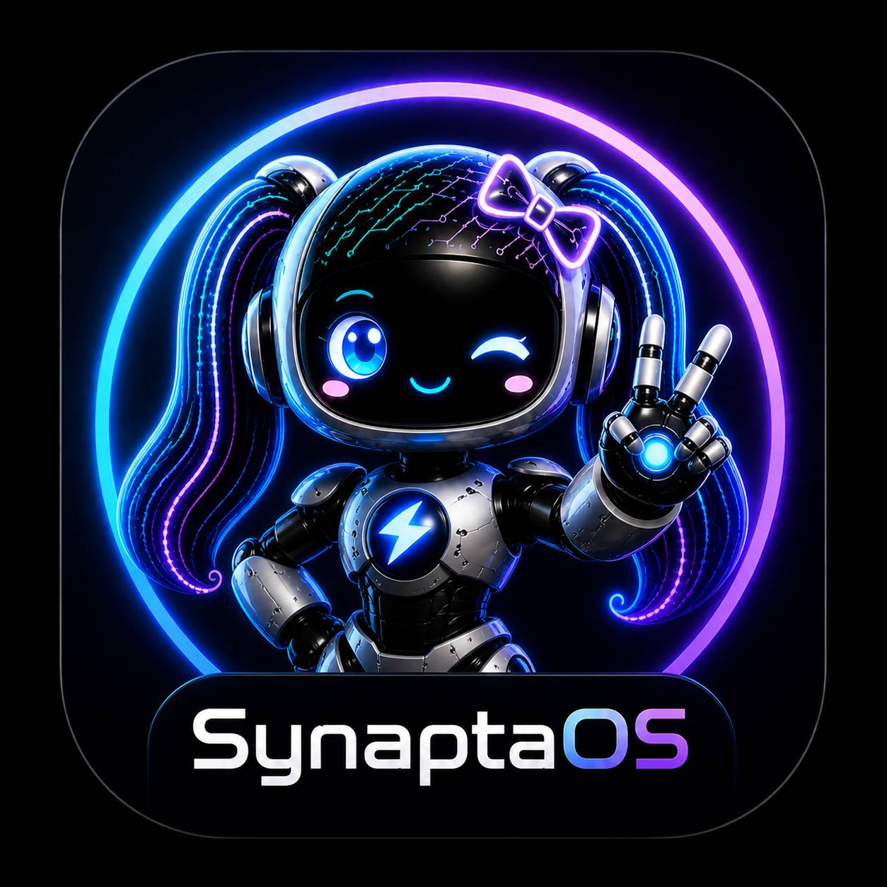
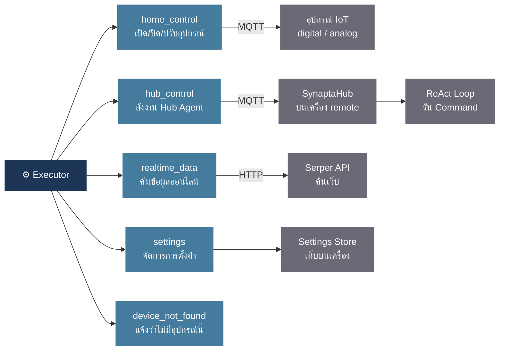

<table><tr>
<td></td>
<td>

# SynaptaOS — Smart Home Dashboard

**Web Application สำหรับควบคุมบ้านอัจฉริยะด้วยภาษาไทยที่เป็นธรรมชาติ**  
ผสานระบบสั่งการอุปกรณ์ IoT, ควบคุมคอมพิวเตอร์ระยะไกล และระบบค้นหาข้อมูลออนไลน์ภายนอก จบในสถาปัตยกรรมเดียวผ่านการพิมพ์หรือสั่งการด้วยเสียง

</td>
</tr></table>

---

## Powered by Typhoon AI 🇹🇭

โครงสร้างสมองกลหลักของ SynaptaOS ขับเคลื่อนด้วย [Typhoon v2.5 (`typhoon-v2.5-30b-a3b-instruct`)](https://opentyphoon.ai) ซึ่งเป็น Large Language Model (LLM) ประสิทธิภาพสูงสำหรับภาษาไทยโดยเฉพาะจาก SCBX ทำให้ระบบเข้าใจบริบทคำสั่งภาษาพูดทั่วไป รวมถึงการพิมพ์สลับสองภาษา (Thai-English Code-switching) ได้อย่างแม่นยำ

> 🔑 **API Key Registration:** [playground.opentyphoon.ai/settings/api-key](https://playground.opentyphoon.ai/settings/api-key)

---

## Core Features

- **Natural Language Interface:** รองรับการพิมพ์และการสั่งงานด้วยเสียง (ผ่าน Chrome/Edge) โดยระบบสามารถตีความคำสั่งภาษาพูดทั่วไปได้โดยไม่จำเป็นต้องจำ Syntax เป๊ะๆ
- **MQTT Protocol Integration:** ควบคุมและสั่งการอุปกรณ์ IoT แบบ Real-time ผ่านสถาปัตยกรรม MQTT ที่มีความหน่วงต่ำ
- **Remote Computer Control:** ควบคุมคอมพิวเตอร์เครื่องปลายทางจากระยะไกลผ่าน Hub Agent ในลักษณะ Agent-to-Agent
- **Hybrid Device Support:** รองรับชนิดอุปกรณ์ที่หลากหลาย ทั้งสาย Digital (ON/OFF), Analog (เช่น Dimmer หรี่แสง) และโครงสร้างเครื่องคอมพิวเตอร์ (Hub)
- **Live Search Tooling:** ค้นหาและดึงข้อมูลอัปเดตจากภายนอกแบบ Real-time (เช่น ราคาหลักทรัพย์ พยากรณ์อากาศ หรือข่าวสาร) มาวิเคราะห์ร่วมกับคำสั่งผ่าน Serper API
- **Serverless Architecture:** ทำงานบนฝั่ง Browser ทั้งหมด สามารถ Deploy เป็น Static Site บนแพลตฟอร์มอย่าง Vercel ได้ทันที

---

## Getting Started

### 1. API Configuration
ไปที่หน้า **Settings → Section 02 Language Model** จากนั้นระบุค่าดังนี้:

| Parameter | Value |
|---|---|
| **API Endpoint** | `https://api.opentyphoon.ai/v1` |
| **API Key** | (กรอก API Key ที่ได้รับจากแพลตฟอร์ม OpenTyphoon) |
| **Model** | `typhoon-v2.5-30b-a3b-instruct` |

### 2. MQTT Broker Setup
ไปที่หน้า **Settings → Section 05** ค่าเริ่มต้นเป็น HiveMQ Public Broker พร้อมใช้งานได้เลยโดยไม่ต้องตั้งค่าเพิ่มเติม

### 3. Add Devices
ไปที่หน้า **Devices** แล้วกดปุ่ม **Add** เพื่อลงทะเบียนอุปกรณ์:

| Type | Use Case |
|---|---|
| **digital** | อุปกรณ์ที่มีสถานะแบบทวิภาค (ON/OFF) เช่น หลอดไฟ, ปลั๊กไฟ, รีเลย์ |
| **analog** | อุปกรณ์ที่ต้องการส่งหรือรับค่าตัวเลขต่อเนื่อง เช่น ไฟหรี่ (Dimmer), ความเร็วพัดลม |
| **hub** | คอมพิวเตอร์ปลายทางที่ต้องการเปิดสิทธิ์การเข้าถึงเพื่อสั่งการระยะไกล |

---

## SynaptaHub — Hub Agent

> 📦 **Repository:** [github.com/Ninlapat5G/SynaptaHub-V0](https://github.com/Ninlapat5G/SynaptaHub-V0)

SynaptaHub คือโปรแกรมที่รันเป็น Background Process บนเครื่องที่ต้องการควบคุม คอยรับคำสั่งจาก AI และลงมือทำงานบนเครื่องนั้นผ่าน MQTT

### รันตรง

```bash
git clone https://github.com/Ninlapat5G/SynaptaHub-V0.git
cd SynaptaHub-V0
cp .env.example .env
pip install -r requirements.txt
python agent.py
```

### Build เป็น .exe (สำหรับ Deploy ไปเครื่องอื่น)

```bash
pip install -r requirements_builder.txt
python build_gui.py
```

เปิด GUI กรอก API Key และค่า MQTT แล้วกด **Build** — ได้ `dist/SynaptaHubAgent.exe` พร้อม `.env` ย้ายไปรันบนเครื่องปลายทางได้เลย

---

## SynaptaNode — ESP32 / Arduino Library

> 📦 **Repository:** [github.com/Ninlapat5G/SynaptaNode-V0](https://github.com/Ninlapat5G/SynaptaNode-V0)

SynaptaNode คือ Arduino Library สำหรับ Flash ลง ESP32 เพื่อให้อุปกรณ์ฮาร์ดแวร์รับคำสั่งจาก SynaptaOS ได้โดยตรงผ่าน MQTT โดยไม่ผ่าน Hub

```cpp
#include <Synapta.h>

SynaptaDigital lamp("bedroom/lamp");

void setup() {
    Synapta.wifi("MyWiFi", "password");
    Synapta.baseTopic("home/smarthome");
    Synapta.start();
}
void loop() { Synapta.loop(); }
```

---

## Skills

| Skill | Description |
|---|---|
| `mqtt_publish` | ส่งคำสั่งควบคุมไปยังอุปกรณ์ IoT ผ่าน MQTT |
| `hub` | สั่งการ SynaptaHub บนเครื่องปลายทางผ่าน Agent-to-Agent |
| `web_search` | ค้นหาและดึงข้อมูล Real-time จากอินเทอร์เน็ต |
| `manage_settings` | อ่านและแก้ไข Settings ของระบบผ่านภาษาธรรมชาติ |

---

## Tech Stack

| Layer | Technology |
|---|---|
| UI | React 18 + Vite 5 + Tailwind CSS |
| AI / Agent | LangGraph Plan-and-Execute + Typhoon v2.5 |
| IoT Communication | MQTT over WebSocket (mqtt.js) |
| Hub Agent | Python + LangGraph + paho-mqtt |
| Deployment | Vercel (Static Site) |

---

## System Architecture

### Overview

ทุกครั้งที่ผู้ใช้งานส่งข้อความ ระบบจะประมวลผลผ่าน **AI Graph** หนึ่งรอบตั้งแต่ต้นจนจบ แล้วจึงส่งคำตอบกลับ


---

### Node Descriptions

#### 🧠 Router — วิเคราะห์คำสั่งและวางแผน

รับข้อความจากผู้ใช้งานพร้อมสถานะอุปกรณ์ทั้งหมด แล้ววางแผนลำดับการดำเนินการ

| ตัวอย่างคำสั่ง | การดำเนินการ |
|---|---|
| "เปิดไฟห้องนั่งเล่น" | วางแผนส่ง MQTT ไปยังอุปกรณ์ทันที |
| "ถ้า BTC เกิน 100k เปิดไฟ" | วางแผนค้นข้อมูลก่อน แล้วใช้ผลลัพธ์มาตัดสินใจ |
| "สวัสดี" | ส่งต่อไปยัง Chat Node โดยไม่ดำเนินการใดๆ |
| "หรี่ไฟ" (ไม่ระบุค่า) | ขอข้อมูลเพิ่มเติมก่อนดำเนินการ |

---

#### ⚙️ Executor — ดำเนินการตาม Plan

รัน Step ที่ Router วางแผนไว้ โดย `home_control` และ `hub_control` รันแบบขนาน (Parallel) ระหว่างการทำงานจะมี **Tool Pill** แสดงสถานะแต่ละ Step แบบ Real-time



---

#### 🔍 Evaluator — ตัดสินใจเมื่อมีเงื่อนไข

ใช้งานเฉพาะกรณีที่คำสั่งมีเงื่อนไข เช่น "ถ้า BTC เกิน 100k เปิดไฟ"

```
รอบ 1 → Router ค้นราคา BTC → ได้ผล "$115k"
รอบ 2 → Evaluator ตรวจสอบ: 115k > 100k ✓ → สั่งเปิดไฟ
```

รองรับเงื่อนไขซ้อนหลายชั้น วนซ้ำได้จนกว่าการตัดสินใจจะเสร็จสมบูรณ์

---

#### 💬 Chat — ตอบสนทนาทั่วไป

ใช้งานเมื่อผู้ใช้ทักทาย ถามข้อมูลทั่วไป หรือเมื่อระบบต้องการข้อมูลเพิ่มเติมก่อนดำเนินการ — Stream คำตอบตามบุคลิกที่กำหนดไว้ใน System Prompt

---

#### 📝 Response — สรุปผลลัพธ์

หลังจาก Step ทั้งหมดเสร็จสิ้น Node นี้จะ Stream สรุปผลเป็นภาษาธรรมชาติ โดยอ้างอิงจากผลลัพธ์จริงเท่านั้น

---

#### 💾 Memory — บันทึกบริบทการสนทนา

ทำงานหลังจากส่งคำตอบให้ผู้ใช้เรียบร้อยแล้ว โดยบีบอัดบทสนทนาให้เหลือเพียง 3 ส่วนสำคัญเพื่อส่งต่อในรอบถัดไป:

| ข้อมูลที่บันทึก | วัตถุประสงค์ |
|---|---|
| สรุปบทสนทนา | ให้ระบบ "จำ" บริบทจากการสนทนาก่อนหน้า |
| คำสั่งอุปกรณ์ล่าสุด | รองรับการอ้างอิงแบบ Implicit เช่น "ปิดเลย" หรือ "อันนั้น" |
| ข้อมูลที่รอรับจากผู้ใช้ | ติดตามคำถามที่ค้างอยู่จากรอบก่อนหน้า |

---

### UI State During Processing

| ช่วงเวลา | สิ่งที่แสดงบน UI |
|---|---|
| กำลังวางแผน | Bubble แสดงสถานะ "กำลังคิด" |
| Executor กำลังทำงาน | Tool Pill แสดงสถานะแต่ละ Step แบบ Real-time |
| Evaluator กำลังตัดสินใจ | Bubble แสดงข้อความสถานะ |
| กำลัง Stream คำตอบ | Bubble หายไป ข้อความปรากฏทีละคำ |

---

## Onboarding Agent

ระบบต้อนรับผู้ใช้งานใหม่และนำทาง Setup API Key ในครั้งแรกที่เปิดแอปพลิเคชัน ดำเนินการผ่านตัวละคร **"น้องซิน" (Syn)**

### Flow


Router ของ Onboarding ตัดสินใจจาก `stage` และ `userName` โดยไม่ใช้ LLM:

| เงื่อนไข | การดำเนินการ |
|---|---|
| `stage = intro`, ยังไม่ทราบชื่อ | `extract_name` — ดึงชื่อจากข้อความของผู้ใช้ |
| `stage = intro`, ทราบชื่อแล้ว | `explain_setup` — เตรียม Guide การตั้งค่า |
| `stage = setup` | `inspect_system` + `explain_setup` — ตรวจสอบ API Key และแนะนำขั้นตอน |
| `stage = farewell` | `farewell` — ส่งท้ายและส่งต่อไปยัง Main Agent |
